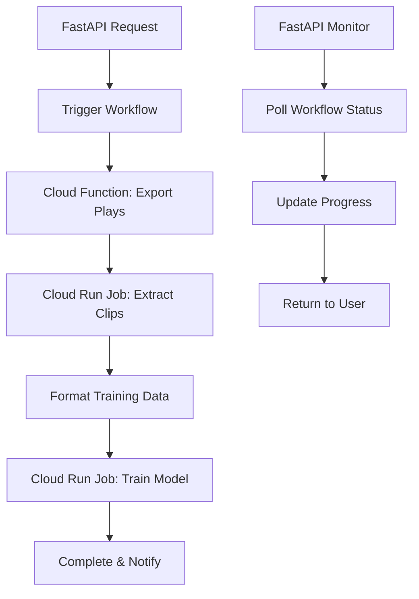

# 🏗️ Hybrid Training Architecture

## Overview

The **Hybrid Training Architecture** combines the best of Google Cloud services for optimal performance and cost efficiency:

- **⚡ Cloud Functions** for fast database operations
- **💪 Cloud Run Jobs** for heavy video/ML processing  
- **🎭 Cloud Workflows** for orchestration
- **🚀 FastAPI** for API endpoints and monitoring

## 🏛️ Architecture Diagram

```
FastAPI (Cloud Run Service)
├── POST /api/training/pipeline → Triggers hybrid workflow
├── GET /api/training/progress/{job_id} → Real-time monitoring
└── GET /api/training/status/{job_id} → Job status
                    ↓
            Cloud Workflows
         (hybrid-training-pipeline)
                    ↓
┌─── Cloud Function ────┐  ┌─── Cloud Run Jobs ────┐
│                       │  │                       │
│ export-plays-cf       │  │ extract-clips-job     │
│ • Fast DB queries     │  │ • 16GB RAM, 8 vCPU    │
│ • 2GB RAM, 900s       │  │ • 24hr timeout        │
│ • Serverless scaling  │  │ • ffmpeg processing   │
│                       │  │                       │
└───────────────────────┘  │ train-model-job       │
                           │ • 8GB RAM, 4 vCPU     │
                           │ • 24hr timeout        │
                           │ • Vertex AI training  │
                           └───────────────────────┘
```

## 🎯 Benefits

| Aspect | Local Dev | Legacy Cloud | **Hybrid Cloud** |
|--------|-----------|--------------|------------------|
| **Speed** | Fast | Slow startup | ⚡ **Optimal** |
| **Resources** | Limited | Limited | 💪 **High (32GB)** |
| **Timeout** | No limit | 60 min | 🕐 **24 hours** |
| **Cost** | Free | Pay always | 💰 **Pay per use** |
| **Scalability** | None | Limited | 🚀 **Auto-scale** |
| **Monitoring** | Manual | Basic | 📊 **Real-time** |

## 🚀 Quick Start

### 1. Deploy Infrastructure

```bash
# Set environment variables
export GCP_PROJECT_ID="your-project-id"
export SUPABASE_SERVICE_KEY="your-key"

# Deploy everything
./scripts/deployment/deploy_hybrid_training.sh
```

### 2. Configure Environment

```bash
# Use hybrid mode
cp .env.hybrid .env

# Update with your values
nano .env
```

### 3. Test the Pipeline

```bash
# Start FastAPI with hybrid mode
TRAINING_MODE=hybrid uvicorn app.main:app --port 8000

# Trigger training
curl -X POST "http://localhost:8000/api/training/pipeline" \
  -H "Content-Type: application/json" \
  -d '{"game_id": "your-game-id"}'

# Monitor progress
curl "http://localhost:8000/api/training/progress/{job_id}"
```

## 📋 Components

### 🔧 Cloud Function: export-plays-cf

**Purpose:** Fast database export  
**Resources:** 2GB RAM, 15min timeout  
**Trigger:** HTTP (called by workflows)

```bash
# Deploy manually
cd functions/export-plays-cf
gcloud functions deploy export-plays-cf \
  --runtime python311 \
  --trigger-http \
  --memory 2GB \
  --timeout 900s
```

### 🏃 Cloud Run Job: extract-clips-job

**Purpose:** Video processing with ffmpeg  
**Resources:** 16GB RAM, 8 vCPU, 24hr timeout  
**Features:** Parallel processing, video caching

```bash
# Build and deploy
cd jobs/extract-clips
docker build -t gcr.io/$PROJECT_ID/extract-clips .
docker push gcr.io/$PROJECT_ID/extract-clips
```

### 🤖 Cloud Run Job: train-model-job

**Purpose:** ML model training  
**Resources:** 8GB RAM, 4 vCPU, 24hr timeout  
**Features:** Vertex AI integration, incremental training

```bash
# Build and deploy
cd jobs/train-model
docker build -t gcr.io/$PROJECT_ID/train-model .
docker push gcr.io/$PROJECT_ID/train-model
```

### ⚙️ Cloud Workflow: hybrid-training-pipeline

**Purpose:** Orchestrate the entire pipeline  
**Features:** Error handling, progress tracking, timeout management

```bash
# Deploy workflow
gcloud workflows deploy hybrid-training-pipeline \
  --source=workflows/hybrid-training-pipeline.yaml \
  --location=us-central1
```

## 🔄 Training Flow



## 🎛️ Environment Modes

### Development Mode (`TRAINING_MODE=local`)
```bash
# Runs scripts directly for fast iteration
python scripts/training/export_plays.py --game-id abc123
python scripts/training/extract_clips.py plays.json
python scripts/training/train_model.py --training-data data.jsonl
```

### Production Mode (`TRAINING_MODE=hybrid`)
```bash
# Uses Cloud Functions + Jobs for scalability
gcloud workflows run hybrid-training-pipeline \
  --data='{"game_id": "abc123"}' \
  --location=us-central1
```

## 📊 Monitoring & Debugging

### Real-time Progress Tracking

```bash
# Get detailed progress
curl "http://localhost:8000/api/training/progress/train-abc123"

# Response includes:
{
  "job_id": "train-abc123",
  "status": "running",
  "current_step": "extract_clips_job",
  "progress_percentage": 50.0,
  "message": "🎬 Processing video clips",
  "video_progress": {
    "current": 25,
    "total": 50,
    "percentage": 50.0
  },
  "estimated_time_remaining": "15.3 minutes"
}
```

### Log Viewing

```bash
# Cloud Function logs
gcloud functions logs read export-plays-cf --limit=50

# Cloud Run Job logs  
gcloud logging read "resource.type=cloud_run_job" --limit=50

# Workflow execution logs
gcloud workflows executions describe EXECUTION_ID \
  --workflow=hybrid-training-pipeline \
  --location=us-central1
```

## 🛠️ Troubleshooting

### Common Issues

**1. Function Deployment Fails**
```bash
# Check permissions
gcloud auth list
gcloud projects add-iam-policy-binding $PROJECT_ID \
  --member="user:$(gcloud config get-value account)" \
  --role="roles/cloudfunctions.developer"
```

**2. Job Image Build Fails**
```bash
# Enable Container Registry API
gcloud services enable containerregistry.googleapis.com

# Authenticate Docker
gcloud auth configure-docker
```

**3. Workflow Execution Fails**
```bash
# Check workflow syntax
gcloud workflows validate --source=workflows/hybrid-training-pipeline.yaml

# Check execution details
gcloud workflows executions describe EXECUTION_ID \
  --workflow=hybrid-training-pipeline \
  --location=us-central1
```

**4. Environment Variables Missing**
```bash
# Verify Cloud Function env vars
gcloud functions describe export-plays-cf --region=us-central1

# Update function environment
gcloud functions deploy export-plays-cf \
  --update-env-vars SUPABASE_URL=new-url
```

## 🎯 Performance Tuning

### Resource Optimization

**Cloud Function**
- Use 2GB memory for database operations
- 900s timeout is sufficient for most exports

**Extract Clips Job**
- Scale memory based on video size (8-16GB)
- Use SSD persistent disk for caching
- Parallel workers = vCPU count

**Train Model Job**
- GPU recommended for large datasets
- Monitor Vertex AI quotas
- Use incremental training when possible

### Cost Optimization

```bash
# Use preemptible instances for jobs (coming soon)
# Set appropriate timeouts to avoid runaway costs
# Monitor usage with billing alerts
```

## 🔮 Future Enhancements

- **GPU support** for video processing
- **Preemptible instances** for cost savings  
- **Auto-scaling** based on queue depth
- **Multi-region** deployment
- **Enhanced monitoring** with custom metrics

## 📚 Additional Resources

- [Cloud Functions Documentation](https://cloud.google.com/functions/docs)
- [Cloud Run Jobs Documentation](https://cloud.google.com/run/docs/create-jobs)
- [Cloud Workflows Documentation](https://cloud.google.com/workflows/docs)
- [Vertex AI Training Documentation](https://cloud.google.com/vertex-ai/docs/training)